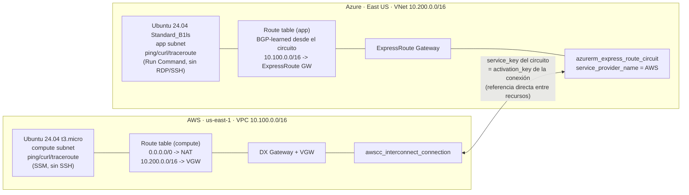

# aws-azure-interconnect

PoC de conectividad privada entre AWS y Azure usando **AWS Interconnect** (GA desde abril 2026) y su contraparte **Azure Multicloud Interconnect** (preview). Región elegida: **us-east-1 ↔ East US** - el único par válido entre las 4 regiones del preview que incluye N. Virginia.

**Estado: nada desplegado todavía.** Este repo es la planificación + el Terraform listo para revisar, no un `apply` ya corrido. **100% `terraform apply`, sin ningún paso manual** - ver la sección de abajo para el porqué y el caveat importante que eso trae.

## Arquitectura



Las dos instancias son **Ubuntu 24.04 LTS** en ambos lados (mismo SO en las dos nubes a propósito - si falla un ping/curl, es la red, no una diferencia de herramientas), con `iputils-ping`/`curl`/`net-tools`/`dnsutils`/`traceroute` instalados vía `apt`. Ninguna tiene un puerto de administración abierto (ni SSH ni RDP) - se gestionan por SSM (AWS) y Run Command (Azure), la misma decisión de "sin bastion" ya tomada en el trabajo de EKS/AKS: estas 2 instancias **son** el "bastion" pedido, solo que sin acceso interactivo. Tráfico permitido entre ambas nubes: **ICMP, HTTP (80), HTTPS (443 - sin certificado real todavía, mismo echo plano) y 8080**.

El ruteo entre las dos redes lo resuelve el circuito/BGP automáticamente (ninguna de las dos FAQs pide configurar rutas a mano) - la tabla de rutas de cada subnet ya enruta hacia el gateway local, y el gateway aprende por BGP el CIDR de la otra nube a través del Interconnect.

## Qué maneja Terraform - y por qué ya no hay ningún paso manual

Investigado a fondo el 2026-09-13 (no solo "¿existe el resource?", sino "¿se puede automatizar de verdad, sin depender del Portal?"):

**Lado AWS: resuelto con `hashicorp/awscc`, no con `hashicorp/aws`.** `hashicorp/aws` 6.64.0 no tiene ningún recurso `aws_interconnect*` (confirmado contra el registro de Terraform). Pero AWS Interconnect pasó a **GA en abril 2026** y CloudFormation recibió soporte el día 1 (`AWS::Interconnect::Connection`) - y **`hashicorp/awscc`** (el provider "Cloud Control", generado automáticamente del mismo schema que usa CloudFormation) **ya tiene `awscc_interconnect_connection`** con el schema completo. Este repo usa `aws` para todo lo demás y `awscc` puntualmente para este recurso - patrón normal, no un hack.

**Lado Azure: la Portal wizard "Multicloud Interconnect" resultó ser un wrapper de algo que ya existe.** La búsqueda inicial de una feature nueva llamada "Multicloud Interconnect" no encontró nada automatizable (ni CLI extension real - se probaron y descartaron `interconnect` y `multicloud-connector`, ninguna tiene que ver -, ni ARM/Bicep, ni REST spec). Pero `az network express-route list-service-providers` **ya lista "AWS" como Service Provider clásico de ExpressRoute**, con `peeringLocations: [australiaeast, germanywc, useast, uswest]` - las 4 regiones del preview, exactas, no una coincidencia. Eso significa que el circuito no es más que un `azurerm_express_route_circuit` de toda la vida (recurso viejo, sin ningún gap) con `service_provider_name = "AWS"` - y su atributo `service_key` es la activation key que el lado AWS necesita. Cero pasos de Portal.

⚠️ **Caveat honesto**: esto es una inferencia fuerte (el match exacto de regiones no puede ser casualidad), no un `apply` real confirmado - esta sesión tiene instrucción explícita de no tocar cuentas reales. Antes de un `apply` de verdad, vale la pena confirmar que este circuito "clásico" efectivamente completa el handshake multicloud (y no solo crea un circuito ExpressRoute sin más). Si no fuera así, el plan B (crear el circuito a mano en el Portal y pasar su ID) queda documentado en `CLAUDE.md`.

| Recurso | Terraform |
|---|---|
| VPC + VNet (reusando `aws-vpc` y `azure-virtual-network`) | ✅ |
| DX Gateway + VPN Gateway (AWS) | ✅ |
| `awscc_interconnect_connection` (AWS, redime la key) | ✅ |
| `azurerm_express_route_circuit` (Azure, genera la key) | ✅ |
| ExpressRoute Virtual Network Gateway + Connection (Azure) | ✅ |
| Las 2 instancias de prueba (EC2 + VM) | ✅ |
| Ruteo + NACL para que las 2 redes se vean (`routing.tf`) | ✅ |

## Networking: qué hace falta además de los Security Groups/NSG

Revisado el 2026-09-14 leyendo el código fuente real de `aws-vpc`/`azure-virtual-network` (no asumido) - un Security Group/NSG permisivo **no alcanza solo** para que el tráfico cruce entre las 2 nubes. Se encontraron 2 gaps reales del lado AWS:

1. **La route table de la subnet `compute`** (creada por el módulo `aws-vpc`) solo tiene `0.0.0.0/0 → NAT Gateway` - sin una ruta explícita a `10.200.0.0/16` por el VPN Gateway, el tráfico hacia Azure saldría por el NAT (a una IP pública) o no saldría. `routing.tf` agrega esa ruta vía `data.aws_route_table` (por `subnet_id`, sin depender de tags) + `aws_route`.
2. **La NACL "private"** (compartida por `compute`+`data`) solo permite tráfico intra-VPC (`10.100.0.0/16`) - todo lo que cruza a `10.200.0.0/16` cae en el deny implícito sin importar lo que diga el Security Group (la NACL es *stateless* y se evalúa antes, a nivel de subnet). Punto más sutil: la NACL tampoco tenía **ninguna regla egress de puertos efímeros** hacia afuera - el módulo la diseñó para instancias que solo *inician* conexiones salientes, no para recibir conexiones entrantes desde fuera de la VPC. Sin esa regla, la respuesta a una conexión que Azure inicia hacia nosotros queda bloqueada de salida aunque la conexión entrante sí se haya permitido. `routing.tf` agrega las reglas de ICMP/80/443/8080 en ambos sentidos, más la regla de puertos efímeros de salida que faltaba.

**Del lado Azure no hizo falta tocar nada** - `azure-virtual-network`'s `rt-app` ya tiene `bgp_route_propagation_enabled = true` (la ruta a `10.100.0.0/16` se aprende sola por BGP en cuanto conecta el circuito), y su NSG de subnet permite todo el tráfico Inbound/Outbound con origen/destino el service tag `VirtualNetwork` - que por diseño de Azure incluye las redes conectadas vía ExpressRoute, no solo la VNet local.

## Costos (confirmados vía las APIs de precios públicas de cada nube, 2026-09-13)

| Recurso | Costo | Notas |
|---|---|---|
| AWS Interconnect | **Gratis hasta 500 Mbps** (Tier 1, uno por región/proveedor) | El circuito de Azure solo ofrece 1 Gbps como opción (`bandwidthsOffered`) - a confirmar si igual cae en el tier gratuito del lado AWS o si al ser 1 Gbps ya no aplica |
| Azure Multicloud Interconnect / circuito AWS | **Gratis durante el preview** | Precio de GA no anunciado todavía |
| DX Gateway (AWS) | Gratis | Objeto lógico, sin cargo por hora |
| VPN Gateway (AWS, `aws_vpn_gateway`) | **Gratis** | Confirmado contra el price list público de `AmazonVPC` (`pricing.us-east-1.amazonaws.com`) - el Virtual Private Gateway en sí no tiene cargo por hora. Solo se factura si además se crea una `aws_vpn_connection` (IPsec, $0.05/hora) - este repo no crea ninguna, el VGW acá solo sirve de punto de asociación del DX Gateway |
| ExpressRoute Virtual Network Gateway (Azure), SKU `Standard` | **$0.19/hora ≈ $138.70/mes** (730 hs) | Confirmado contra la Azure Retail Prices API (`prices.azure.com`) para `eastus`. **El recurso más caro y más lento de este PoC** - tarda 30-60 min en aprovisionarse y sigue facturando por hora hasta que se borra. Otros SKUs en la misma región: HighPerformance $0.49/h, ErGw1AZ $0.361/h, ErGw2AZ $0.632/h, ErGw3AZ $2.151/h, UltraPerformance $1.87/h - `Standard` es el más barato que soporta `type = "ExpressRoute"` |
| NAT Gateway regional (AWS, vía módulo `aws-vpc`) | ~$0.045/hora × 1 AZ (`az_count = 1` a propósito) | Igual que en `aws-vpc`, nada de esto es gratis por defecto |
| EC2 `t3.micro` + VM `Standard_B1ls` | Centavos/hora cada una | Las instancias más baratas que sirven para el test |

**El costo real de este PoC es casi enteramente del lado Azure** - la ExpressRoute Gateway (~$139/mes) no tiene equivalente pago del lado AWS: el DX Gateway y el VPN Gateway que cumplen el mismo rol de "attach point" son ambos gratis.

**Ninguno de los dos servicios de Interconnect tiene contrato de largo plazo ni fee de cancelación** - todo es facturación por hora o gratis-en-preview, borrable en cualquier momento.

## Prerrequisitos

- Cuenta AWS con acceso a `us-east-1` y permisos para Direct Connect/VPN Gateway/EC2/Interconnect.
- Suscripción Azure con acceso a `eastus` y permisos para Network/Compute/ExpressRoute.
- Una clave pública SSH para `var.azure_vm_ssh_public_key` (no se usa para acceder de verdad, Azure la exige igual para crear la VM).
- `terraform >= 1.10`, con los providers `aws ~> 6.0`, `azurerm ~> 5.0` y `awscc ~> 1.0`.

## Uso

```hcl
# terraform.tfvars (no versionar - ver .gitignore)
azure_subscription_id   = "<tu subscription id>"
azure_vm_ssh_public_key = "ssh-ed25519 AAAA..."
```

```
terraform init
terraform plan   # revisar antes de aplicar - ver tabla de costos arriba
terraform apply
```

Después del `apply`: `terraform output aws_interconnect_connection_state` y `terraform output azure_express_route_circuit_service_provider_provisioning_state` para confirmar que el handshake completó de ambos lados (transiciona por `requested → pending → available` en AWS, `NotProvisioned → Provisioning → Provisioned` en Azure - puede tardar).

Probar conectividad real: `aws ssm start-session` / `az vm run-command invoke` para pingear y hacer `curl` en los puertos 80, 443 y 8080 entre los outputs `aws_instance_private_ip` y `azure_vm_private_ip` (`traceroute`/`mtr` también disponibles si hay que ver por dónde va la ruta).

## Teardown

`terraform destroy` cubre absolutamente todo - no queda ningún recurso creado fuera de Terraform que limpiar a mano.

## Módulos reusados

- [`aws-vpc`](https://github.com/jalcalaroot/aws-vpc) `v0.6.3`
- [`azure-virtual-network`](https://github.com/jalcalaroot/azure-virtual-network) `v0.4.0`
