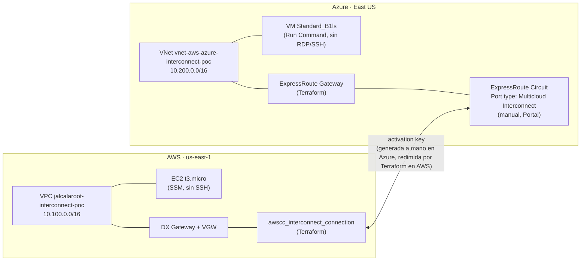

# aws-azure-interconnect

PoC de conectividad privada entre AWS y Azure usando **AWS Interconnect** (GA desde abril 2026) y su contraparte **Azure Multicloud Interconnect** (preview). Región elegida: **us-east-1 ↔ East US** - el único par válido entre las 4 regiones del preview que incluye N. Virginia.

**Estado: nada desplegado todavía.** Este repo es la planificación + el Terraform listo para revisar, no un `apply` ya corrido.

## Arquitectura



Ninguna instancia tiene un puerto de administración abierto (ni SSH ni RDP) - se gestionan por SSM (AWS) y Run Command (Azure), la misma decisión de "sin bastion" ya tomada en el trabajo de EKS/AKS. Lo único que cruza la conexión es ICMP y un HTTP echo en el puerto 8080, para probar que la ruta privada funciona.

## Qué maneja Terraform y qué no

Investigado a fondo el 2026-09-13 (no solo "¿existe el resource?", sino "¿se puede automatizar de verdad?"):

| Maneja Terraform (este repo) | Se crea a mano (una sola vez) |
|---|---|
| VPC + VNet (reusando `aws-vpc` y `azure-virtual-network`) | El circuito ExpressRoute con Port type "Azure Multicloud Interconnect" (**solo Azure Portal** - ver por qué abajo) |
| DX Gateway + VPN Gateway (lado AWS) | Generar la activation key ahí mismo |
| **`awscc_interconnect_connection`** (lado AWS - redime la key, ver abajo) | |
| ExpressRoute Virtual Network Gateway + Connection (lado Azure) | |
| Las 2 instancias de prueba (EC2 + VM) | |

**Lado AWS: automatizable, pero no con el provider `aws`.** `hashicorp/aws` 6.64.0 no tiene ningún recurso `aws_interconnect*` (confirmado contra el registro de Terraform). Pero AWS Interconnect pasó a **GA en abril 2026** y CloudFormation recibió soporte el día 1 (`AWS::Interconnect::Connection`) - y **`hashicorp/awscc`** (el provider "Cloud Control", generado automáticamente del mismo schema que usa CloudFormation) **ya tiene `awscc_interconnect_connection`** con el schema completo. Por eso este repo usa `aws` para todo lo demás y `awscc` puntualmente para este recurso - es un patrón normal, no un hack.

**Lado Azure: no hay ninguna superficie de automatización todavía, confirmado probando, no solo buscando en la doc.** Se descartaron en orden: `az network express-route create --help` (sin parámetros para esto), 2 extensiones de CLI con "interconnect"/"multicloud" en el nombre (`interconnect` = grupos de nodos HPC/InfiniBand, no tiene nada que ver; `multicloud-connector` = Azure Arc Public Cloud Connector, tampoco), ningún ejemplo de ARM/Bicep publicado, ningún spec de REST API encontrado en `Azure/azure-rest-api-specs`. La única guía oficial (`learn.microsoft.com/.../create-interconnect`) documenta exclusivamente los clicks del Portal. Por eso el circuito en sí es el único paso manual de todo este repo - todo lo que depende de su ID (conectarlo al Virtual Network Gateway) sí es Terraform normal (`azurerm_virtual_network_gateway_connection`, un recurso viejo y estable).

## Costos (confirmados vía las APIs de precios públicas de cada nube, 2026-09-13)

| Recurso | Costo | Notas |
|---|---|---|
| AWS Interconnect | **Gratis hasta 500 Mbps** (Tier 1, uno por región/proveedor) | El preview con Azure está topado a 1 Gbps igual, así que entra en el tier gratuito |
| Azure Multicloud Interconnect | **Gratis durante el preview** | Precio de GA no anunciado todavía |
| DX Gateway (AWS) | Gratis | Objeto lógico, sin cargo por hora |
| VPN Gateway (AWS, `aws_vpn_gateway`) | **Gratis** | Confirmado contra el price list público de `AmazonVPC` (`pricing.us-east-1.amazonaws.com`) - el Virtual Private Gateway en sí no tiene cargo por hora. Solo se factura si además se crea una `aws_vpn_connection` (IPsec, $0.05/hora) - este repo no crea ninguna, el VGW acá solo sirve de punto de asociación del DX Gateway |
| ExpressRoute Virtual Network Gateway (Azure), SKU `Standard` | **$0.19/hora ≈ $138.70/mes** (730 hs) | Confirmado contra la Azure Retail Prices API (`prices.azure.com`) para `eastus`. **El recurso más caro y más lento de este PoC** - tarda 30-60 min en aprovisionarse y sigue facturando por hora hasta que se borra. Otros SKUs en la misma región: HighPerformance $0.49/h, ErGw1AZ $0.361/h, ErGw2AZ $0.632/h, ErGw3AZ $2.151/h, UltraPerformance $1.87/h - `Standard` es el más barato que soporta `type = "ExpressRoute"` |
| NAT Gateway regional (AWS, vía módulo `aws-vpc`) | ~$0.045/hora × 1 AZ (`az_count = 1` a propósito) | Igual que en `aws-vpc`, nada de esto es gratis por defecto |
| EC2 `t3.micro` + VM `Standard_B1ls` | Centavos/hora cada una | Las instancias más baratas que sirven para el test |

**El costo real de este PoC es casi enteramente del lado Azure** - la ExpressRoute Gateway (~$139/mes) no tiene equivalente pago del lado AWS: el DX Gateway y el VPN Gateway que cumplen el mismo rol de "attach point" son ambos gratis.

**Ninguno de los dos servicios de Interconnect tiene contrato de largo plazo ni fee de cancelación** - todo es facturación por hora o gratis-en-preview, borrable en cualquier momento. El único costo "standing" fuera del Interconnect es el ExpressRoute Gateway (y el NAT Gateway del lado AWS), y esos también son pay-as-you-go sin permanencia.

## Prerrequisitos

- Cuenta AWS con acceso a `us-east-1` y permisos para Direct Connect/VPN Gateway/EC2/Interconnect.
- Suscripción Azure con acceso a `eastus` y permisos para Network/Compute, más acceso al Portal para el paso manual.
- Una clave pública SSH para `var.azure_vm_ssh_public_key` (no se usa para acceder de verdad, Azure la exige igual para crear la VM).
- `terraform >= 1.10`, con los providers `aws ~> 6.0`, `azurerm ~> 5.0` y `awscc ~> 1.0`.

## Paso manual (el único de todo este repo)

Antes del primer `apply`, en el [Azure Portal](https://portal.azure.com) → **Hybrid connectivity** → **Azure Multicloud Interconnect** → **Set up Azure Multicloud Interconnect**:

1. Crear el circuito: Port type = **Azure Multicloud Interconnect**, proveedor = AWS, región = `eastus`, bandwidth = 500 Mbps (tier gratis).
2. Generar la activation key, usando el Account ID de tu cuenta AWS.
3. Copiar dos cosas: el **resource ID del circuito** (algo como `/subscriptions/.../expressRouteCircuits/...`) y la **activation key**.

Esos dos valores van en `terraform.tfvars` (ver abajo) - de ahí en más todo es `terraform apply`, incluyendo redimir la key del lado AWS.

## Uso

```hcl
# terraform.tfvars (no versionar - contiene la activation key, ver .gitignore)
azure_subscription_id                     = "<tu subscription id>"
azure_vm_ssh_public_key                   = "ssh-ed25519 AAAA..."
azure_multicloud_interconnect_circuit_id  = "/subscriptions/.../expressRouteCircuits/..."
aws_interconnect_activation_key           = "<key generada en el paso manual de arriba>"
```

```
terraform init
terraform plan   # revisar antes de aplicar - ver tabla de costos arriba
terraform apply
```

Después del `apply`: `terraform output aws_interconnect_connection_state` para confirmar que el handshake llegó a `available` (transiciona por `requested → pending → available`, puede tardar).

Probar conectividad real: `aws ssm start-session` / `az vm run-command invoke` para pingear y hacer `curl :8080` entre los outputs `aws_instance_private_ip` y `azure_vm_private_ip`.

## Teardown

`terraform destroy` cubre todo lo Terraform-managed, **incluyendo la conexión de AWS** (`awscc_interconnect_connection`). Borrar el circuito de Azure a mano en el Portal **antes** del destroy, para no dejarlo huérfano facturando sin que nada lo reconozca.

## Módulos reusados

- [`aws-vpc`](https://github.com/jalcalaroot/aws-vpc) `v0.6.3`
- [`azure-virtual-network`](https://github.com/jalcalaroot/azure-virtual-network) `v0.4.0`
