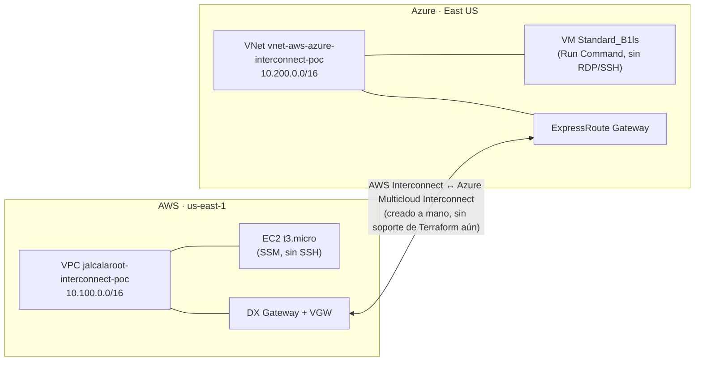

# aws-azure-interconnect

PoC de conectividad privada entre AWS y Azure usando **AWS Interconnect** (preview, anunciado agosto 2026) y su contraparte **Azure Multicloud Interconnect** (preview). Región elegida: **us-east-1 ↔ East US** - el único par válido entre las 4 regiones del preview que incluye N. Virginia.

**Estado: nada desplegado todavía.** Este repo es la planificación + el Terraform listo para revisar, no un `apply` ya corrido.

## Arquitectura



Ninguna instancia tiene un puerto de administración abierto (ni SSH ni RDP) - se gestionan por SSM (AWS) y Run Command (Azure), la misma decisión de "sin bastion" ya tomada en el trabajo de EKS/AKS. Lo único que cruza la conexión es ICMP y un HTTP echo en el puerto 8080, para probar que la ruta privada funciona.

## Qué maneja Terraform y qué no

Confirmado en vivo contra el registro de Terraform (2026-09-13, `hashicorp/aws` 6.64.0 y `hashicorp/azurerm` 5.5.0): **ninguno de los dos providers tiene todavía un recurso para el Interconnect en sí** (ni `aws_interconnect` ni un `azurerm_multicloud_interconnect`). Es un preview muy nuevo, tiene sentido que el soporte de Terraform no haya llegado.

| Maneja Terraform (este repo) | Se crea a mano (ver runbook abajo) |
|---|---|
| VPC + VNet (reusando `aws-vpc` y `azure-virtual-network`) | El recurso "AWS Interconnect" en sí (consola o AWS CLI) |
| DX Gateway + VPN Gateway (lado AWS) | El recurso "Azure Multicloud Interconnect" en sí (Portal o `az`) |
| ExpressRoute Virtual Network Gateway (lado Azure) | El intercambio de activation key entre ambos lados |
| Las 2 instancias de prueba (EC2 + VM) | |

## Costos (confirmados vía las APIs de precios públicas de cada nube, 2026-09-13)

| Recurso | Costo | Notas |
|---|---|---|
| AWS Interconnect | **Gratis hasta 500 Mbps** (Tier 1, uno por región/proveedor) | El preview con Azure está topado a 1 Gbps igual, así que entra en el tier gratuito |
| Azure Multicloud Interconnect | **Gratis durante el preview** | Precio de GA no anunciado todavía |
| DX Gateway (AWS) | Gratis | Objeto lógico, sin cargo por hora |
| VPN Gateway (AWS, `aws_vpn_gateway`) | **Gratis** | Confirmado contra el price list público de `AmazonVPC` (`pricing.us-east-1.amazonaws.com`) - el Virtual Private Gateway en sí no tiene cargo por hora. Solo se factura si además se crea una `aws_vpn_connection` (IPsec, $0.05/hora) - este repo no crea ninguna, el VGW acá solo sirve de punto de asociación del DX Gateway |
| ExpressRoute Virtual Network Gateway (Azure), SKU `Standard` | **$0.19/hora ≈ $138.70/mes** (730 hs) | Confirmado contra la Azure Retail Prices API (`prices.azure.com`) para `eastus`. **El recurso más caro y más lento de este PoC** - tarda 30-60 min en aprovisionarse y sigue facturando por hora hasta que se borra. Otros SKUs en la misma región: HighPerformance $0.49/h, ErGw1AZ $0.361/h, ErGw2AZ $0.632/h, ErGw3AZ $2.151/h, UltraPerformance $1.87/h - `Standard` es el más barato que soporta `type = "ExpressRoute"` |
| NAT Gateway regional (AWS, vía módulo `aws-vpc`) | ~$0.045/hora × 1 AZ (`az_count = 1` a propósito) | Igual que en `aws-vpc`, nada de esto es gratis por defecto |
| EC2 `t3.micro` + VM `Standard_B1ls` | Centavos/hora cada una | Las instancias más baratas que sirven para el test |

**El costo real de este PoC es casi enteramente del lado Azure** - la ExpressRoute Gateway (~$139/mes) no tiene equivalente pago del lado AWS: el DX Gateway y el VPN Gateway que cumplen el mismo rol de "attach point" son ambos gratis.

**Ninguno de los dos servicios de Interconnect tiene contrato de largo plazo ni fee de cancelación** - todo es facturación por hora o gratis-en-preview, borrable en cualquier momento. El único costo "standing" fuera del Interconnect es el ExpressRoute Gateway (y el NAT Gateway del lado AWS), y esos también son pay-as-you-go sin permanencia.

## Prerrequisitos

- Cuenta AWS con acceso a `us-east-1` y permisos para Direct Connect/VPN Gateway/EC2.
- Suscripción Azure con acceso a `eastus` y permisos para Network/Compute.
- Una clave pública SSH para `var.azure_vm_ssh_public_key` (no se usa para acceder de verdad, Azure la exige igual para crear la VM).
- `terraform >= 1.10`, con los providers `aws ~> 6.0` y `azurerm ~> 5.0`.

## Uso

```hcl
# terraform.tfvars (no versionar si tiene datos sensibles - ver .gitignore)
azure_subscription_id  = "<tu subscription id>"
azure_vm_ssh_public_key = "ssh-ed25519 AAAA..."
```

```
terraform init
terraform plan   # revisar antes de aplicar - ver tabla de costos arriba
terraform apply
```

## Runbook de activación manual (Interconnect)

Estos pasos no tienen Terraform todavía - hacerlos después del `apply` de arriba, usando los outputs `aws_dx_gateway_id` y `azure_expressroute_gateway_id`:

1. Elegir de qué lado se genera la activation key (cualquiera de los dos sirve, ambos caminos están soportados).
2. **Desde AWS**: crear el recurso "AWS Interconnect - multicloud" apuntando a Azure como proveedor, región `us-east-1`, adjuntado al `aws_dx_gateway_id` de arriba. Comando exacto: `aws help` (buscar el subcomando del preview - no lo asumo acá, es muy nuevo para citarlo de memoria).
3. **Desde Azure**: redimir la key en el recurso "Azure Multicloud Interconnect", región `eastus`, apuntando al `azure_expressroute_gateway_id` de arriba. Comando exacto: `az networking --help` (mismo motivo, no lo asumo).
4. Validar que ambos lados confirman proveedor/región/bandwidth/cuenta - si algo no matchea, la activación falla sin re-crear nada (según la FAQ de Azure).
5. No hace falta configurar BGP a mano - lo gestionan ambas nubes.
6. Probar conectividad: `aws ssm start-session` / `az vm run-command invoke` para pingear y curl:8080 entre `aws_instance_private_ip` y `azure_vm_private_ip`.

## Teardown

`terraform destroy` cubre todo lo Terraform-managed. Borrar el recurso Interconnect de cada lado (Portal/consola) **antes** de correr el destroy, para no dejar un recurso manual huérfano facturando sin nada Terraform que lo reconozca.

## Módulos reusados

- [`aws-vpc`](https://github.com/jalcalaroot/aws-vpc) `v0.6.3`
- [`azure-virtual-network`](https://github.com/jalcalaroot/azure-virtual-network) `v0.4.0`
