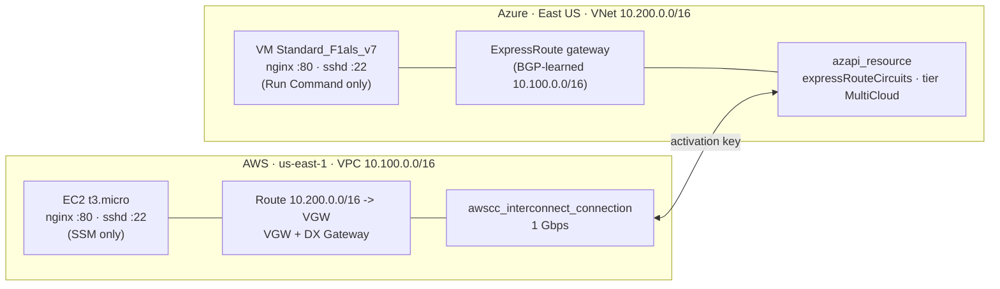

# aws-azure-interconnect

Terraform PoC for private, cloud-to-cloud connectivity between **AWS** (us-east-1) and **Azure** (East US) using **AWS Interconnect - multicloud** and **Azure Multicloud Interconnect** (public preview). No VPN, no public internet, no manual portal steps.

Verified end-to-end: two Ubuntu hosts, one per cloud, reach each other over private IPs (ping, TCP 22/80, HTTP).

## Architecture


```mermaid
flowchart LR
    subgraph AWS["AWS · us-east-1 · VPC 10.100.0.0/16"]
        ec2["EC2 t3.micro\nnginx :80 · sshd :22\n(SSM only)"]
        vgw["Route 10.200.0.0/16 -> VGW\nVGW + DX Gateway"]
        conn["awscc_interconnect_connection\n1 Gbps"]
        ec2 --- vgw --- conn
    end
    subgraph Azure["Azure · East US · VNet 10.200.0.0/16"]
        vm["VM Standard_F1als_v7\nnginx :80 · sshd :22\n(Run Command only)"]
        ergw["ExpressRoute gateway\n(BGP-learned 10.100.0.0/16)"]
        circuit["azapi_resource\nexpressRouteCircuits · tier MultiCloud"]
        vm --- ergw --- circuit
    end
    conn <-->|"activation key"| circuit
```

| Layer | Resources | Provider |
|---|---|---|
| AWS network | VPC, DX Gateway, VGW, route + NACL rules for `10.200.0.0/16` | `aws` |
| AWS interconnect | `awscc_interconnect_connection` (redeems the activation key) | `awscc` |
| Azure network | VNet, `GatewaySubnet`, ExpressRoute gateway + connection | `azurerm` |
| Azure interconnect | ExpressRoute circuit, tier `MultiCloud` (generates the key) | `azapi` |
| Test hosts | Ubuntu 24.04 on each side, identical bootstrap (`local.test_server_bootstrap`) | `aws` / `azurerm` |

The VPC and VNet come from [`aws-vpc`](https://github.com/jalcalaroot/aws-vpc) `v0.6.3` and [`azure-virtual-network`](https://github.com/jalcalaroot/azure-virtual-network) `v0.4.0`. Hosts have no public IP and no SSH/RDP exposure; access is SSM (AWS) and Run Command (Azure).

## How the handshake works

The Azure side creates a `Microsoft.Network/expressRouteCircuits` resource and exports an **activation key**; the AWS side redeems it. Terraform wires them with a direct reference (`activation_key = azapi_resource.circuit.output.properties.activationKey`).

Details that are easy to get wrong (API `2025-09-01`):

- `sku.tier = "MultiCloud"` (`name = "MultiCloud_MeteredData"`), not `Standard`.
- `properties.partnerAccountId` must be the AWS account that redeems the key.
- The key to redeem is `properties.activationKey` (base64), **not** `serviceKey` (a placeholder GUID on these circuits).
- Bandwidth must match on both sides. 1 Gbps is the only preview size, so AWS uses `"1Gbps"`.
- `azurerm` (5.8) does not expose the tier or those properties, hence `azapi`. `azapi` 2.13 only embeds schemas up to `2025-07-01`, so `schema_validation_enabled = false` is set on that one resource.

## Routing

Security groups alone are not enough on AWS:

- The `compute` route table only had `0.0.0.0/0 -> NAT`; `routing.tf` adds `10.200.0.0/16 -> VGW`.
- The `private` NACL only allowed intra-VPC traffic and no ephemeral-port egress; `routing.tf` adds ICMP/22/80/443/8080 in both directions plus the missing ephemeral egress.

Azure needs nothing extra: the route table propagates BGP routes and the `VirtualNetwork` service tag covers ExpressRoute-connected networks.

## Verified results

| Check | Result |
|---|---|
| AWS connection state | `available`, 1 Gbps |
| Azure circuit | `serviceProviderProvisioningState = Provisioned` |
| BGP | 4 sessions `Connected` (ASN 12076); Azure learns `10.100.0.0/16` via `12076-64512` |
| ICMP | 0 % loss, ~3-4 ms RTT |
| `telnet <ip> 22` / `80` | connects (SSH banner / nginx `200 OK`), both directions |
| Traceroute (Azure to AWS; AWS-side hops do not answer TTL) | gateway `10.200.255.x`, then link-local `169.254.255.x` |
| Fresh bootstrap | both hosts recreated with `-replace`: cloud-init `done`, nginx active, `telnet`/`traceroute`/`nc` installed, hello world served on :80 and :443 |

## Usage

Requirements: Terraform >= 1.10; AWS credentials for us-east-1; an Azure subscription for East US; providers `aws ~> 6.0`, `azurerm ~> 5.0`, `awscc ~> 1.104`, `azapi ~> 2.13`.

```hcl
# terraform.tfvars (git-ignored)
azure_subscription_id   = "<subscription-id>"
azure_vm_ssh_public_key = "ssh-ed25519 AAAA..."   # required by Azure, never used to log in
```

```bash
terraform init && terraform plan && terraform apply   # the ExpressRoute gateway takes ~30 min
terraform output aws_interconnect_connection_state
terraform output azure_express_route_circuit_service_provider_provisioning_state
```

Check routes: `az network vnet-gateway list-bgp-peer-status` and `list-learned-routes` on the ExpressRoute gateway.

## Testing connectivity

Hosts are private, so enter through SSM or Run Command. IPs: `terraform output aws_instance_private_ip` / `azure_vm_private_ip`.

**AWS to Azure** (needs the Session Manager plugin):

```bash
aws ssm start-session --region us-east-1 --target <instance-id>
# inside the session:
ping -c 5 <azure-ip>
telnet <azure-ip> 22      # SSH banner (exit: Ctrl+] then quit)
telnet <azure-ip> 80      # type: GET / HTTP/1.0  + Enter twice -> 200 OK, hello world
curl http://<azure-ip>    # "hello world desde Azure (<ip>)"
```

**Azure to AWS**:

```bash
az vm run-command invoke -g rg-aws-azure-interconnect-poc -n vm-aws-azure-interconnect-poc \
  --command-id RunShellScript --query "value[0].message" -o tsv --scripts \
  'ping -c 5 <aws-ip>; (sleep 2) | telnet <aws-ip> 22; (printf "GET / HTTP/1.0\n\n"; sleep 2) | telnet <aws-ip> 80; curl -s http://<aws-ip>'
```

| Output | Meaning |
|---|---|
| `Connected to <ip>` | TCP open; traffic crossed the interconnect |
| `Connection refused` | reached the host, nothing listening |
| `Trying...` then timeout | blocked on the path (SG, NSG, NACL or routing) |

When scripting `telnet`, send the request with `\n`, not `\r\n`: the client adds an extra CR and nginx answers `400`.

## Cost

Approximate, `us-east-1` / `eastus`, while the stack is up:

| Resource | Cost |
|---|---|
| ExpressRoute gateway (Standard) | $0.19/h |
| NAT gateways (AWS + Azure) + public IPs | ~$0.10/h combined |
| `Standard_F1als_v7` + `t3.micro` | ~$0.07/h |
| Azure Multicloud Interconnect | free during preview |
| AWS Interconnect | free up to 500 Mbps; **1 Gbps is $1.37/h on the AWS price list and it is unconfirmed whether the Azure preview is billed** |
| DX Gateway, VGW | free |

Roughly **$0.4/h**, or about **$1.7/h** if AWS bills the 1 Gbps. The gateway keeps billing until destroyed.

## Teardown

```bash
terraform destroy      # the ExpressRoute gateway takes 15-45 min to delete
```

Then verify by hand that nothing is left (`az resource list -g rg-aws-azure-interconnect-poc`, `aws ec2 describe-vpcs`, `aws directconnect describe-direct-connect-gateways`). If an `apply` is interrupted, resources may exist in the cloud without being in state, and `destroy` will not remove them.

## Known limitations

- Azure Multicloud Interconnect is a **public preview**: AWS only, 1 Gbps only, no SLA, one gateway connection per interconnect, regions Australia East / East US / Germany West Central / West US.
- The peering shows `Disabled` in the circuit JSON even with BGP sessions up.
- `aws-vpc` defines the `compute` route table with inline routes, so the standalone `aws_route` to `10.200.0.0/16` is treated as drift: each plan removes and re-creates it (a few seconds without the route). Fix: let the module accept extra routes.
- Global names (storage accounts, Key Vault) in `network.tf` are overridden to avoid collisions with `azure-virtual-network` defaults.
- `Standard_B1ls` is not deployable in some subscriptions; `Standard_F1als_v7` (NVMe, Gen2) is used instead.

## References

- [Azure Multicloud Interconnect overview](https://learn.microsoft.com/en-us/azure/multicloud-interconnect/overview) · [availability and limits](https://learn.microsoft.com/en-us/azure/multicloud-interconnect/availability-limits)
- [ExpressRoute Circuits - Get (2025-09-01)](https://learn.microsoft.com/en-us/rest/api/expressroute/express-route-circuits/get?view=rest-expressroute-2025-09-01)
- [AWS Interconnect pricing](https://docs.aws.amazon.com/interconnect/latest/userguide/interconnect-pricing.html)
- [Building Azure Multicloud Interconnect to AWS](https://www.simonpainter.com/building-azure-multicloud-interconnect-to-aws/)

See [SECURITY.md](SECURITY.md) for reporting issues and `CLAUDE.md` for the working notes and failure history.
